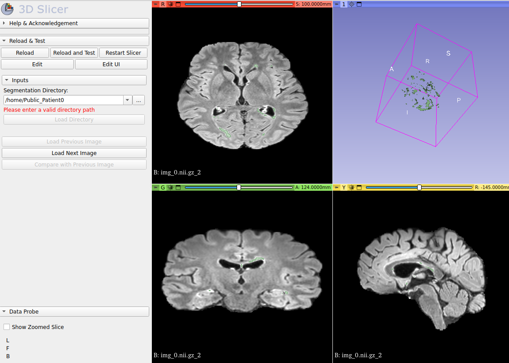

# MS_lesion_visualiser
A Slicer 3D extension to visualise multiple sclerosis lesions, and toggle between imagery at different timepoints.

The extension contains a single module, which reads in multiple sclerosis imagery and segmentations in a specific format, and displays them. It also allows you to easily toggle between images in different time points.

## Tutorial:
The data must be in the format:

- patient_folder
    - img_0.nii.gz
    - img_1.nii.gz
    - img_[...].nii.gz
    - img_0_segmentation.nrrd
    - img_1_segmentation.nrrd
    - img_[...]_segmentation.nrrd
    - img_sub_0.nii.gz
    - img_sub_0_segmentation.nrrd

There must be the same number of images as segmentations. Sub images are images meant to be a comparison between images of two timepoints (for instance, a subtraction). If there are n images, then there can be n-1 sub images.

